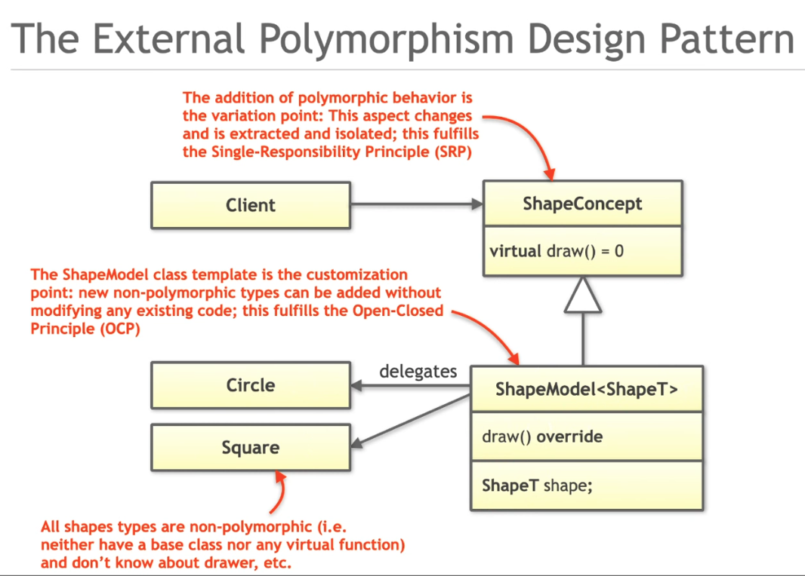

# Notes

## Procedural example

- In `oreilly_olt_cpp_software_design/Tasks/2_Cpp_Software_Design/Motivation/Procedural.cpp` pretty much everything depends on the `ShapeType` enum. A simple change here will
  - break ABI (i.e. everything that assumed a certain binary structure for `ShapeType` enum will be in for a surprise)
  - all dependencies will have to recompile. e.g. if you add a triangle to `ShapeType` enum, the `Square`, `Circle` etc. will also have to compile resulting in increased build time
  - switch statement will have to be extended each time

## Object oriented example

- See `oreilly_olt_cpp_software_design/Tasks/2_Cpp_Software_Design/Motivation/ObjectOriented.cpp`
- This gets rid of the `ShapeType` enum altogether and hands the responsibility of draw API to individual class
- The `Shapes` base class has a pure virtual function called `draw` that the concrete class will implement
- But notice that all shapes are still dependent of the graphics library

## Visitor design pattern

- Useful pattern to add features to a class without changing the class itself. This is achieved by delegating the responsibility of implementing the feature to the so called visitor class. There can be a visitor implementation for a given feature. In other words, the features are implemented as small dedicated classes instead of a function within the original class
- The class that needs a new feature provides its own instance (in other words, registers) with the so called visitor class
- The visitor then calls the necessary methods on the class to get whatever information it needs to implement the feature. e.g. We can implement a class called `Area`. This class would be a concrete implementation of a Visitor interface class. A visitor class that is supposed to calculate areas of shapes will call the getRadius() method on a circle, getSideLength() on a square, etc. to calculate the area.

### Visitor classic implementation

- See `oreilly_olt_cpp_software_design/Tasks/2_Cpp_Software_Design/Visitor`
- The core idea for the visitor class is to add a new functionality "easily". We have the left side (Visitor hierarchy) and the right side (the client hierarchy). In the classic visitor design pattern, both sides accept the other side's instance using designated methods.
- Client side calls `visit(*this)` and gives its own instance to visitor. Visitor then does something with it.
- Visitor side calls `accept(*this)` and gives its own instance to all clients. Clients then do something with it.
- There is cyclic dependency in the classic visitor design pattern
- On the visitor side, we implement different concrete implementations for the different functionality that we want to implement. See `Visitor_Refactoring.cpp` for example. Here, you can implement `Area` class, which would be a concrete implementation of `ShapeVisitor`, just like the `GlDrawer`
- However, as you'd notice, since the signature of `visit` function is fixed, it puts some serious limitations on what the operation can actually return, modify, etc.

### Modern C++ implementation

Consider following code:

```cpp
struct Print{

    void operator()(int value) {std::cout << "I am an int:" << value << std::endl;}
    void operator()(double value) {std::cout << "I am a double:" << value << std::endl;}
};

int main()
{
    int value = 5;
    double dvalue = 5.5;
    struct Print p{};
    p(value);
    p(dvalue);
    return 0;
}
```

- There's `std::variant<T1,T2,T3...>` class that is equivalent to C union. e.g. `std::variant<int,double,std::string>`will hold either int, double, or a string.
- With this variant class, we can do the same exact thing but in a much concise manner

```cpp
std::variant<int, double> v;
std::visit(Print{}, v);
```

Notice here that the left and right args of the visit function are the left and right sides of the visitor pattern hierarchy respectively

### Refactoring the shapes program

Take a look at the refactored version of `oreilly_olt_cpp_software_design/Tasks/2_Cpp_Software_Design/Visitor/Visitor_Refactoring.cpp`. Here, we have:

- `using Shape = std::variant<Circle, Square>;` i.e. declared a variant to use all kinds of shapes and made a vector out of them `using Shapes = std::vector<Shape>;`
- In the vector of Shapes, we insert the instances `shapes.emplace_back( std::make_unique<Circle>( 4.1 ) );`
- In `drawAllShapes` we then `std::visit(drawer, shape);`, where `drawer` is the same graphics library wrapper class as before except in there we now have defined operator() like `void operator()( Circle const& circle ) const`

In effect, we don't have any base classes

#### Advantages and disadvantages

- This solution, as we can check from benchmarking, is almost twice as fast as the object oriented design because there are no abstract classes, virtual functions, pointers and redirection etc.
- Bad: Adding new shapes is still not easy. **If your intention is to support adding and deleting shapes, this is not the pattern for you**

## Strategy design pattern

Let's say we wanted the flexibility to add more or less shapes ad-hoc. The visitor pattern will be still inconvenient. Among other things, the classes like `GlDrawer` will get bigger and bigger as we introduce operator() implementations.
Going back to the object oriented ideas where we can have something like this:

```text
    Shape
      ^
  ____|____
 |         |
 Circle    Square

```

- If Shape has `draw` pure virtual function, everything inheriting from it will have to _implement_ it and that will create dependency on the graphics library (because `draw()` will have to call some graphics library functions)
- To avoid this, we can further inherit from concrete implementations. See `oreilly_olt_cpp_software_design/PDF/2_Cpp_Software_Design.pdf`. slide# 121 where `OpenGlCircle`, `MetalCircle` are inheriting from `Circle` and overriding `draw()`
- The issue here is that when we add more functions, like `Serialize`, the inheritance layers will keep growing. So this isn't feasible.

### Solution

- (Direct) Inheritance is rarely an answer. Choose composition instead.
- In strategy, instead of using inheritance, we use composition. e.g. Circle will be constructed by injecting (passing to its constructor), an object that is able to provide implementation from `draw`
  - In this case, the Circle will be the context and the entity that provides `draw()` implementation would be the `strategy`
  - The strategy side therefore will actually have a base class that declares a pure virtual `draw()`
- Note that the strategy implementation is not just limited to injecting the implementation through constructor. We can also use templates. e.g. in std::vector we pass the allocator as the second template parameter
- Strategy pattern is used all over the place without us realizing it in some other ways. For example, by passing lambda functions

#### Classic Implementation

- `oreilly_olt_cpp_software_design/Tasks/2_Cpp_Software_Design/Strategy/Strategy_Refactoring.cpp` shows the classic implementation
  - Concrete shapes still inherit from the Shapes class which has `draw` api
  - `DrawStrategy` is an abstract class for function declarations for different shapes (e.g. `virtual void draw( Circle const& circle ) const = 0;`)
  - The graphics library classes will inherit from this `DrawStrategy` class and implement the `draw` for each shape
  - The concrete shape classes will accept and store the reference to the `DrawStrategy` and eventually forward the `draw` calls

#### Issues with classic implementation

```cpp
class Circle;
class Square;

class DrawStrategy
{
 public:
   virtual ~DrawStrategy() = default;

   virtual void draw( Circle const& circle ) const = 0;
   virtual void draw( Square const& square ) const = 0;
};

class Circle {
  public:
  Circle( double radius, std::unique_ptr<DrawStrategy>&& drawer ) //... init list
  {
    // ... etc.
  }
}
```

In the implementation above, observe:

- Circle and Square are forward declared because DrawStrategy depends on all these shapes
- By looking at Circle constructor, we can tell it depends on DrawStrategy

There are two issues here:

1. There's a cyclic dependency (which is fine and can be taken care of by forward declarations)
2. Circle, Square, etc. indirectly know about each other via DrawStrategy. In order to compile Circle, DrawStrategy needs to be compiled, which needs Square and potentially all other shapes. So we have created indirect dependency

To resolve this indirect dependency, we can create a Strategy class for each shape. i.e. DrawStrategyCircle, DrawStrategySquare, etc. But this will lead to base class explosion. We can use templates instead.
Note that at this point, the GLDrawer will still have to inherit from multiple DrawStrategy classes. e.g DrawStrategy<Square>, DrawStrategy<Circle>, etc.

#### Modern alternative to classing Strategy implementation

- `std::function<T>` takes a callable type as a template parameter
- So, using injections like `using DrawStrategy = std::function<void(Square const&)>;` we can implement strategy design pattern
- In case of the shapes example, the callable object is `GLDrawer` class that implements the `()` operator and based on the argument to the `()` oeprator, appropriate binding takes place.

Even with the modern implementation, strategy feels like a more classical "Reference based" semantics implementation. In modern C++, the goal is to move more and more towards value semantics

## External Polymorphism



This is a useful pattern when we do not have the capability to change the existing classes. So, instead, we wrap around the classes we want to add polymorphic behavior to. For example, in the image above,

- circle and square are the classes we do not want to change
- so we introduce the `ShapeConcept` class, which is pretty much the same as the Shape virtual class we have been using. However, it is a class that we introduce as opposed to it being a part of the design from the beginning
- The ShapeModel class inherits from the `ShapeConcept`, it is templated on the class it's supposed to wrap around (i.e. circle, square, etc.), and also holds the instance of that class. This class also delegates some functionality to the class it's wrapping around.
- This implementation is the next level of strategy design pattern. Strategy "extracted" some functionality from a class (extract = provide external implementation). With external polymorphism, the entire functionality of the class is extracted. Let's see how.

### Code changes walkthrough

- **starter code hierarchy**
  - In `Tasks/2_Cpp_Software_Design/External_Polymorphism/ExternalPolymorphism_1.cpp` we start with the OO implementation of Shapes.
    - `std::vector<std::unique_ptr<Shape>>;` held all the Shape pointers
    - `Shape` itself was a parent class for concrete shapes Circle, etc.
    - Concrete shapes implemented the `draw` function, thereby introducing the dependency to the graphics library
- **switching to external polymorphism heirarchy**
  - now instead of the `Shape` parent class, we have the `ShapeConcept` which is the parent class of `ShapeModel`. Our goal is to extract all of the functionality of the concrete classes in the `ShapeModel` class
  - Hence, `ShapeModel` is templated on the concrete type `ShapeT` (= circle, square, etc.), it implements `draw()` by delegating the call to the `free_draw` functions (as a temp placeholder) as appropriate
  - Now the vector of unique pointers can hold `ShapeConcept` (because its a parent class of the concrete `ShapeModel` class that implements `draw`) and `drawAllShapes` should still work.
  - Notice however that the `draw` is fully implemented externally and the args to it are passed by the `ShapeModel` class. Therefore, the args like `color` passed to concrete shapes are now obsolete. Infact we can go ahead and remove everything that is related to `Shape` class at this point.

### Introducing value semantics**

- Using value semantics means getting rid of all the pointers. In our previous implementation, we had unique pointers to `ShapeConcept` stored in a `std::vector` like `using Shapes = std::vector<std::unique_ptr<ShapeConcept>>;`
- Take a look at `Tasks/2_Cpp_Software_Design/Type_Erasure/TypeErasure_1.cpp`. To begin with, this class is the same as the `ExternalPolymorphism_1.cpp`. We will make the following design changes to this class (see code below):

```cpp
class Shape
{
   public:
   template< typename ShapeT, typename DrawStrategy >
   Shape( ShapeT const& shape, DrawStrategy drawer ):
   pimpl_{std::make_unique<ShapeModel<ShapeT,DrawStrategy>>( shape, std::move(drawer) )}
   {}
   void draw()const{pimpl_->draw();}

   private:
   
   class ShapeConcept
   {
      public:
      virtual ~ShapeConcept() = default;
      
      virtual void draw() const = 0;
   };
   
   template< typename ShapeT
   , typename DrawStrategy >
   class ShapeModel : public ShapeConcept
   {
      public:
      ShapeModel( ShapeT const& shape, DrawStrategy drawer )
      : shape_{ shape }
      , drawer_{ std::move(drawer) }
      {}
      
      void draw() const override { drawer_(shape_); }
      
      private:
      ShapeT shape_;
      DrawStrategy drawer_;
   };
   
   std::unique_ptr<ShapeConcept> pimpl_;
   
};
```

- Introduce a new `Shape` class and move `ShapeModel` and `ShapeConcept` as private members of this class.
- Move the vector with `ShapeConcept` unique pointers inside the new `Shape` class. Let's think about what it means:
  - `ShapeConcept` is just an abstract base class which is implemented by `ShapeModel`.
  - So, if we were to initialize the `ShapeConcept` vector, we'd have to create the instances of `ShapeModel` like before.
  - To create `ShapeModel`, we need the `ShapeT` and the `DrawStrategy` types. We have already done this work by defining the `make_shape_model` function.
  - If we do this type of initialization in the constructor, we would need to templatize that constructor with the required parameters. So, let's reuse `make_shape_model` logic once again, but for construction.
  - Note that once this is done, `Shape` becomes a truly abstract class. That is, there is nothing that tells what shapes are stored in this class. i.e. the type is ERased. This is called **TypeErasure**. In other words, we have erased the type by wrapping with the `Shape` class.
  - The draw function now just calls the draw on `pimpl_`
  - Other changes: now we can create the std::vector of shapes by using the unique pointers to `Shape` directly. We can also pass instances of `Circle`, `GlDrawer`, etc. to `emplace_back`, since `emplace_back` will forward these arguments to the constructor of `Shape` directly. Also, since we're using the value and not unique pointers to `Shape`, we can make function calls using `shape.draw()` (i.e. value semantics)
- So, what did we achieve
  - all the complexity is hidden in the `Shape` class now. Therefore, with the `Shape` implementation aside, code is easy to read and has an easy mental model.
  - code is very maintainable because of the configurability. We can create any shape with any graphics lib without much code.

### Advancing value semantics further

- One of the shortcomings of the `Shape` class above is that it is not possible to copy it because:
  - `unique_ptr` cannot be copied
  - even if we were to provide the copy constructor, etc. it would be impossible to write code to initialize `pimpl_` due to the fact that we need to know the template parameters in advance to initialize it
  - - To fix this issue, we need the `Prototype` design pattern


## Prototype Design Pattern

This design pattern is used to create a clone of an object. The abstract base class `Prorotype` declares a pure virtual function `clone` which the concrete classes implement and return their own copy.


Now consider the following example

```cpp
class Animal
{
 public:
   virtual ~Animal() = default;
   virtual void make_sound() const = 0;
   virtual std::unique_ptr<Animal> clone() const = 0;
};

class Sheep : public Animal
{
 public:
   void make_sound() const override;
   std::unique_ptr<Animal> clone() const override;
};
```

See `Tasks/2_Cpp_Software_Design/Prototype/Prototype.cpp` for full implementation. In the implementation of `clone`, the sheep class returns the `*this`. No surprises there.

### Covariant return type

By standard, the child class has to implement the exact same signature as declared by the parent class. i.e. `Sheep` class has to return the unique pointer to `Animal`, even though it should be allowed to return the `Sheep` pointer. i.e. following implementation won't compile:

```cpp

// notice the Sheep instead of Animal in the return type
std::unique_ptr<Sheep> Sheep::clone() const
{
   std::cout << " Sheep::clone()\n";
   return std::make_unique<Sheep>(*this);
}
```

There is one exception to this though. If we were to return the raw pointers everywhere like so:

```cpp
class Animal
{
 public:
   virtual ~Animal() = default;
   virtual void make_sound() const = 0;
   // notice raw pointer return
   virtual Animal* clone() const = 0;
};

class Sheep : public Animal
{
 public:
   void make_sound() const override;
   Sheep* clone() const override;
};
```

The above code will compile, because there is an exception for this against the standards. this works because compiler recognizes `Animal*` and `Sheep*` as covariant return types.

Now, let's assume that we would like the Sheep class to return the exact type of itself when cloned, as opposed to Animal. e.g. it maybe handy in figuring out at the calling location what the type of the object being received is, etc. So how can we combine the prototype design pattern and covariant return type idea?

## Introducing `clone` concept to TypeErasure

To enable copying of objects that we don't know the type of, we can incorporate the `clone` concept to the `TypeEarasure` example. See `Tasks/2_Cpp_Software_Design/Type_Erasure/TypeErasure_1.cpp`

```cpp
   shapes.emplace_back(shapes[0]); // copy the instance at 0th position here
```

The above line requires the `Shape` type to be copyable. But as we've seen before, because of TypeErasure, we have no idea what the underlying datatype of shape is, and therefore, we couldn't provide a copy constructor or assignment operator in the Shape class. Implementation wise, it all came down to how to initialize the `pimpl_`

With clone implemented now, we can achieve that. See implementation in the corresponding commit.

### Move operation

The Rule of Five in C++ states that if you define any of the following special member functions, you must define all of them:

- Copy constructor: MyClass(const MyClass&)
- Copy assignment operator: MyClass& operator=(const MyClass&)
- Move constructor: MyClass(MyClass&&)
- Move assignment operator: MyClass& operator=(MyClass&&)
- Destructor: ~MyClass()

In the code we wrote so far, there are no move operations because as soon as you defined the copy operation, it is up to the user to provide the move operation as well.
In copy operations, we're simply copying/assigning the `pimpl` unique pointer with the help of the `clone` call. In case  of unique pointers, by design, if you move the unique pointer (in this case the `pimpl`) from a source to a target, the source will end up having a null pointer in `pimpl`.
So, whenever we combine prototype and type erasure, we must think about whether or not it's ok to 

- leave move unimplemented and hence unavailable
- implement move and let the  source unique pointer to be null


## Bride design pattern

Even with TypeErasure and External Ploymorphism design pattern, we have non-value symantics like std::make_unique in our Shape implementation. We would like to remove dynamic memory allocation altogether.

### Context

Consider the following example:

```cpp
class Car
{
  public:
    void drive();
  
  private:
    EngineGen1 engine_;
    BatteryGen1 battery_;

}
```

The user of this `Car` class would have to recompile the class every time the underlying classes change their implementation. In other words, the dependency of these classes will cause an ABI break every time the implementation details of the `Car` class has changed.

The easiest and the most obvious way to avoid this ABI break is to use the pointers to these classes instead of the instances. i.e.

```cpp
// Forward declarations
struct EngineGen1;
struct BatteryGen1;

class Car
{
  public:
    void drive();
  
  private:
    std::unique_ptr<EngineGen1> engine_;
    std::unique_ptr<BatteryGen1> battery_;

}
```

Even in this case though, replacing the `EngineGen1` or `BatteryGen1` with other classes, e.g. `EngineGen2` will require change in code and recompile.

As the next iteration, we can instead abstract out all the implementation details in a `pimpl` like before.

```cpp

class Car
{
  public:
    void drive();
    Car() : pimpl_{std::make_unique(ElectricCarImpl{})}
    {
      //
    }
  
  private:
    std::unique_ptr<CarmImpl> pimpl;

}

class CarImpl{
  public:
  // some functions

  private:
  // maybe some private members
}

class ElectricCarImpl: public CarImpl{

  // this is where we will implement all the details and will contain the ever changing battery, engine, etc.
}
```

This is essentially the classic Bridge design pattern


This looks very similar to strategy design pattern. But the key difference is that the Strategy design pattern is about dependency injection - meaning getting the implementation from someone else. e.g. a graphics library. We may not even know how a particular functionality is implemented.
The Bridge design pattern is about hiding the implementation details instead. We implement all the concerned dependencies ourself. But we just hide it behind the implementation class.

### Basic Implementation

- In `Tasks/2_Cpp_Software_Design/Bridge/Pimpl.cpp`, in commit `760827903b87b8244391ca233ada9413226d21ba`, we have forward declared the `strct Impl` in the `Model10` class *HEADER* and as a result, we are able to declare a unique pointer to that type.
  - by doing this, we avoid inclusion of engine and battery header files, but also of the Impl header file. This is the *trick* of the Bridge design pattern
- We then can initialize this unique pointer in the *SOURCE* file which *DEFINES* the `Impl` class and therefore actually knows about it.
- All of this works as long as we use the raw pointer to the `Impl`  class. But when we try to use the unique pointer to Impl in the same setup, things will not compile. Here's why:
- We have not provided destructor to the Model10 class, therefore compiler will make one for us
- This destructor is actually created in the header file. i.e. `Model10.h` - the class declaration here has the unique pointer to `Impl`. When compiler invokes destructor on this unique pointer, it will also need the destructor for the `Impl` class. But the `Impl` class is unknown to the header file beyond the forward declaration. Therefore, when the header is compiled, the compilation will fail.
- A simple trick to get around this issue is to declare the Model10 destructor in the header file, but define it as default in the source file.


### Fast implementation

See `Solutions/2_Cpp_Software_Design/Bridge/FastPimpl.cpp` for a version of Bridge pattern that's fast because the memory for the impl class is allocated on the buffer on the stack as opposed to dynamically allocated memory. Here, there are two things to note:

1. The use of "placement new", which takes an additional memory location parameter like this: `new(buffer_) Impl{}` indicating that the memory for Impl is allocated in the `buffer_`
2. Assertions for size and alignment of `Impl` so it can fit and align properly in the buffer
3. provision of pimpl() which is a tiny function that `reinterpret_cast`s the buffer into the Impl class type
4. explicit call to Impl destructor from the Model10 destructor
5. because destructor is defined, move, copy and assignment constructors shall also be implemented


### TypeErasure

There are two possible implementations:

- See `Tasks/2_Cpp_Software_Design/Type_Erasure/TypeErasure_SBO_1.cpp` for example of TypeErasure implementation of Bridge pattern - has reinterpret cas
- See `Tasks/2_Cpp_Software_Design/Type_Erasure/TypeErasure_SBO_1.cpp` - no reinterpret cast